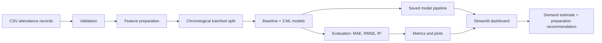
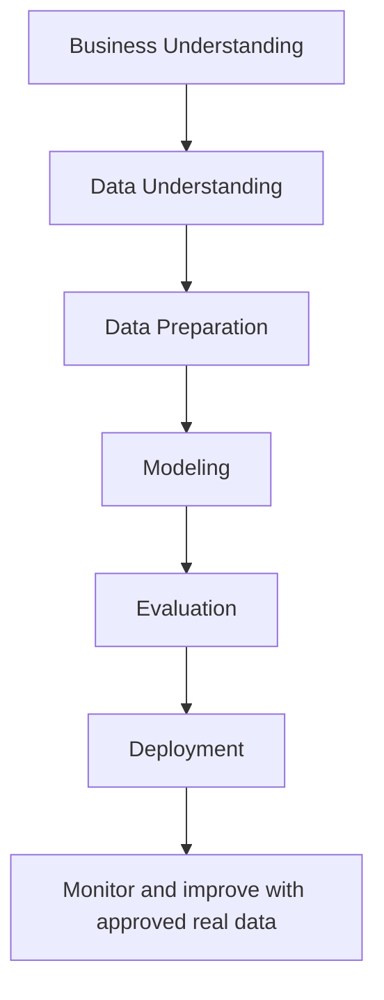

# Architecture diagram

```mermaid
flowchart LR
    A[CSV attendance records] --> B[Validation]
    B --> C[Feature preparation]
    C --> D[Chronological train/test split]
    D --> E[Baseline + 3 ML models]
    E --> F[Evaluation: MAE, RMSE, R²]
    E --> G[Saved model pipeline]
    F --> H[Metrics and plots]
    G --> I[Streamlit dashboard]
    H --> I
    I --> J[Demand estimate + preparation recommendation]
```

# CRISP-DM workflow

```mermaid
flowchart TD
    A[Business Understanding] --> B[Data Understanding]
    B --> C[Data Preparation]
    C --> D[Modeling]
    D --> E[Evaluation]
    E --> F[Deployment]
    F --> G[Monitor and improve with approved real data]
```
